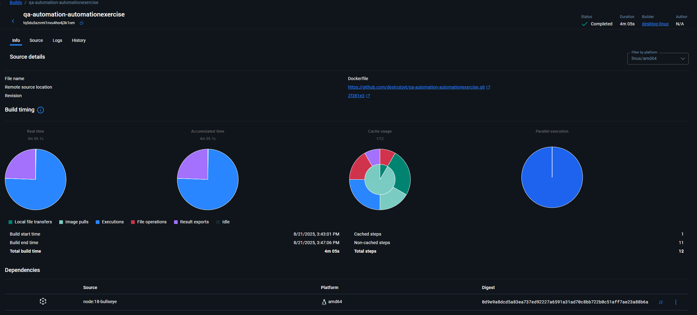

# QA Automation Project (v2.6.0)

[](https://github.com/destrutoyt/yourrepo)


## 🚀 Project Overview

This repository contains a comprehensive QA automation suite targeting the [Automation Exercise](https://automationexercise.com/) demo e-commerce website.

For detailed information about test objectives, scope, design, criteria, and risks, please refer to the [Test Plan](https://github.com/destrutoyt/qa-automation-automationexercise/blob/main/docs/test-plan.md).

## 🛠 Tools & Technologies

- 🧪 **[Playwright](https://playwright.dev/)** – End-to-end and API testing  
- 🔭 **[Postman](https://www.postman.com/)** – API test design and execution  
- 📊 **[Allure](https://allurereport.org/)** – Visual test reports 
- 🐳 **[Docker](https://www.docker.com/)** – Containerized, consistent environments  
- ⚙️ **GitHub Actions** – CI pipeline for test execution and reporting
- 💻 **Node 17+** - Used to enable latest features

## ⚙️ Setup & Installation

Before executing any scripts from `package.json`, execute the following in order:

``` bash
npm i
npx playwright install --with-deps
```
After all dependencies are installed, there are a variety of scripts that you can use to execute test by group, debugging test, run all tests, or run all tests and automatically create an Allure report. Most scripts start with `test:(x)`, but you can find more inside `package.json`.

#### 🐳 Run With Docker
A `Dockerfile` can be found at the root of the project. It contains basic commands to run test within a Docker environment. Please note that it can take more than 5 minutes to create a build. If you want to run the `Dockerfile`, you must use:
```bash
docker build -t (build-name) .
```
Latest Build Status:


## ⚠️ Issues
As of version 2.6.0 (08/21/2025):  
- ✅ Tests are stable and running successfully  
- ✅ Docker builds complete without errors  
- ⚠️ If you encounter any issues, please submit a pull request with suggested fixes

## 📄 License

This project is licensed under the [MIT License](https://github.com/destrutoyt/qa-automation-automationexercise/blob/main/LICENSE).
